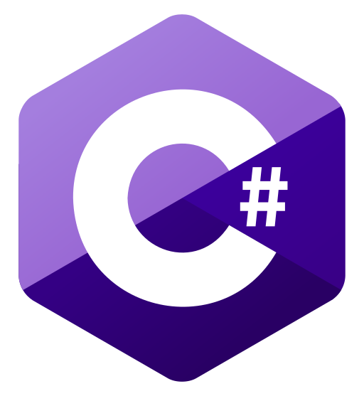

# About Me :wave:

My name is Tiago Henriques, but my friends call me Toscano. I took Information Systems and Computer Engineering at Instituto Superior Técnico in Lisbon, Portugal. My Master is specialized in Interaction and Visualization, and Games. 

# Portfolio

* :mortar_board: University Projects - Instituto Superior Técnico (IST) 
  * Degree 
    * [Software Engineering](https://github.com/Toscan0/IST-ES) - Java project
    * [Distributed Systems](https://github.com/Toscan0/IST-SD) - Java project
    * [Computer Graphics](https://github.com/Toscan0/IST-CG) - Space Invaders game in Three.js
    * [Artificial intelligence](https://github.com/Toscan0/IST-IA) - Lisp project
    * [Database](https://github.com/Toscan0/IST-BD) - SQL project
  * Master
    * :video_game: Games
      * [Master Thesis](https://github.com/Toscan0/IST-Thesis-FaradayMuseum) - Serious game for Android with augmented reality in the context of a museum - Unity / C# 
      * [Game Development Methodology](https://github.com/Toscan0/IST-MDJ) - 2D Platformer Game - Unity / C#
      * [Game Design](https://github.com/Toscan0/IST-DDJ) - 3D Horror/Escape Room/Puzzle Game - Unity / C#
      * [Computer Graphics for Games](https://github.com/Toscan0/IST-CGJ) - Simple Engine - C++ / OpenGL
    * :desktop_computer: Interaction and Visualization
       * [Interactive Visual Communication](https://github.com/Toscan0/IST-CVI)
       * [Information Visualization](https://github.com/Toscan0/IST-VI) - Info Vis about Sociopolitical impact at the Oscars - HTML / JS / d3.js / CSS
       * [Virtual Reality](https://github.com/Toscan0/IST-RV) - Virtual reality art gallery  - Unity / C#
       * [User Centered Design](https://github.com/Toscan0/IST-CCU) - Proof of concept for Porto city metro in virtual reality - Unity / C#
 

* :iphone: Android Apps 
  * [App Bluetooth Sender](https://github.com/Toscan0/Car_leds) - Send values to an arduino by Bluetooth or BLE - Unity / C#

    
* :trophy: :video_game: Game Jams participations
  * Search For a Star
    * [UFO Game](https://github.com/Toscan0/Search-For-A-Star-2021) - Search For a Star 2021 - Unity / C#
  * Global Game Jams
    * [Car Therapy](https://github.com/Toscan0/GGJ2020) - GGJ2020 - Unity / C#
    * [The Flashlight](https://github.com/Toscan0/GGJ2021) - GGJ2021: 2nd place @ Tecnico / Belas-Artes  - Unity / C#
 

* Misclandia of projects and tutorials
  * [Dynamic List in C](https://github.com/Toscan0/Dynamic-List-C)
  * [Mix of projects and tutorials in Unity](https://github.com/Toscan0/Unity-Misc)
  * [Mix of projects and tutorials in Unreal](https://github.com/Toscan0/Unreal-Engine-4-misc)
  * [Mix of projects and tutorials in Blender](https://github.com/Toscan0/Blender-Misc)
  * [My version of Gopher360](https://github.com/Toscan0/Gopher360) - Use your Xbox controller like a pc mouse

# Tools and Languages

 
 

> These are the most recently tools and languages used. But I have more in my toolbox :stuck_out_tongue:

# Connect with me

[][linkedin]

<!-- 

  
:zap: GitHub Stats

 -->

[linkedin]: https://www.linkedin.com/in/tiago-henriques-638252132/
