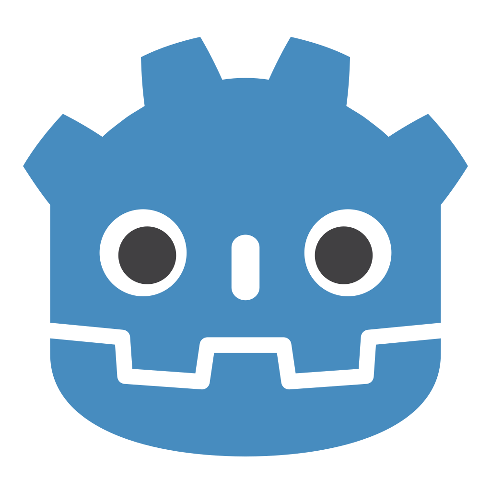
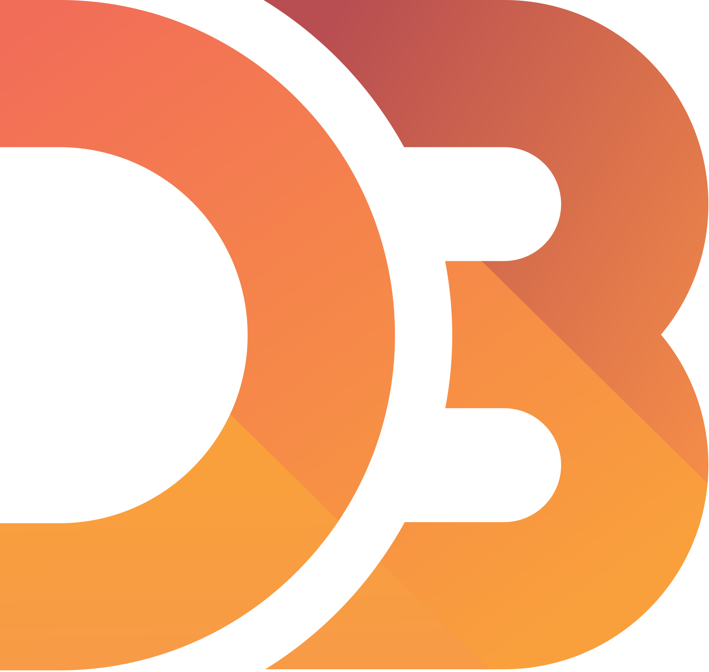
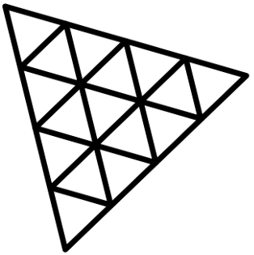

# About Me :wave:

My name is Tiago Henriques, but my friends call me Toscano.\
I took Information Systems and Computer Engineering at Instituto Superior Técnico in Lisbon, Portugal.\
My Msc is specialized in Interaction and Visualization, and Games. 

You can play my games [here][itchio].

# Portfolio

 
 :mortar_board: University Projects - Instituto Superior Técnico (IST) 

  

 * Degree 
     * [Programming Fundamentals](https://github.com/Toscan0/IST-FP) - Python project 
     * [Operating Systems](https://github.com/Toscan0/IST-SO) - C project
     * [Software Engineering](https://github.com/Toscan0/IST-ES) - Java project
     * [Distributed Systems](https://github.com/Toscan0/IST-SD) - Java project
     * [Computer Graphics](https://github.com/Toscan0/IST-CG) - Space Invaders game in Three.js
     * [Artificial intelligence](https://github.com/Toscan0/IST-IA) - Lisp project
     * [Database](https://github.com/Toscan0/IST-BD) - SQL project
   * Master
     * :video_game: Games
       * [Master Thesis](https://github.com/Toscan0/IST-Thesis-FaradayMuseum) - Serious game for Android with augmented reality in the context of a museum - Unity / C# 
       * [Game Development Methodology](https://github.com/Toscan0/IST-MDJ) - 2D Platformer Game - Unity / C#
       * [Game Design](https://github.com/Toscan0/IST-DDJ) - 3D Horror/Escape Room/Puzzle Game - Unity / C#
       * [Computer Graphics for Games](https://github.com/Toscan0/IST-CGJ) - Simple Engine - C++ / OpenGL
     * :desktop_computer: Interaction and Visualization
        * [Interactive Visual Communication](https://github.com/Toscan0/IST-CVI) - MATLAB 
        * [Information Visualization](https://github.com/Toscan0/IST-VI) - Info Vis about Sociopolitical impact at the Oscars - HTML / JS / d3.js / CSS
        * [Virtual Reality](https://github.com/Toscan0/IST-RV) - Virtual reality art gallery  - Unity / C#
        * [User Centered Design](https://github.com/Toscan0/IST-CCU) - Proof of concept for Porto city metro in virtual reality - Unity / C#

 
 :trophy: :video_game: Game Jams participations 

  
 
  * Search For a Star
    * [UFO Game](https://github.com/Toscan0/Search-For-A-Star-2021) - Search For a Star 2021 - Unity / C#
  * Nokia 3310 
    * [Catch The Fly](https://github.com/Toscan0/Nokia-3310-2021) - Nokia-3310 2021 - Unity / C#
  * Global Game Jam
    * [Car Therapy](https://github.com/Toscan0/GGJ2020) - GGJ2020 - Unity / C#
    * [The Flashlight](https://github.com/Toscan0/GGJ2021) - GGJ2021: 2nd place @ Tecnico / Belas-Artes  - Unity / C#
  * Hyper Game Jam
    * [Asteroid Tapper](https://github.com/Toscan0/Hyper-Game-Jam-2021) - Hyper Casual Jam 2021 - Unity / C#
 

   
 :iphone: Android Apps 

    
 
  * [App Bluetooth Sender](https://github.com/Toscan0/Car_leds) - Send values to an arduino by Bluetooth or BLE - Unity / C#
  * [Tic Tac Toe](https://github.com/Toscan0/Tic-Tac-Toe) - Unity / C#

   
 :desktop_computer: Windows Apps 

 
  * [My version of Gopher360](https://github.com/Toscan0/Gopher360) - Use your Xbox controller like a pc mouse

  
 ⚜️Scouts Games 

   
 
   * [Image Bingo](https://github.com/Toscan0/Image-Bingo) - Unity / C#
   * [Mafeking Siege](https://github.com/Toscan0/Siege-of-Mafeking) - Unity / C#

  
 👨‍💻 Misclandia of projects and tutorials 

   
 
  * [Dynamic List in C](https://github.com/Toscan0/Dynamic-List-C)
  * [Mix of projects and tutorials in Unity](https://github.com/Toscan0/Unity-Misc)
  * [Mix of projects and tutorials in Unreal](https://github.com/Toscan0/Unreal-Engine-4-misc)
  * [Mix of projects and tutorials in Blender](https://github.com/Toscan0/Blender-Misc)
  * [Mix of projects and tutorials in Game Maker](https://github.com/Toscan0/GameMaker-Misc)
  * [My pixel art](https://github.com/Toscan0/Pixel-Art)
 
 

:bulb: [My gists](https://gist.github.com/Toscan0)

# Engines

 

# Frameworks and Libraries

  
 

# Languages

 
 

> These are my most recently tools and languages used. But I have more in my toolbox :stuck_out_tongue:

# GitHub stats

# Connect with me

[][itchio]
[][linkedin]
  
&ensp;or email me at j.tiago.henriques@tecnico.ulisboa.pt

[linkedin]: https://www.linkedin.com/in/tiago-henriques-638252132/
[itchio]: https://toscan0.itch.io/
